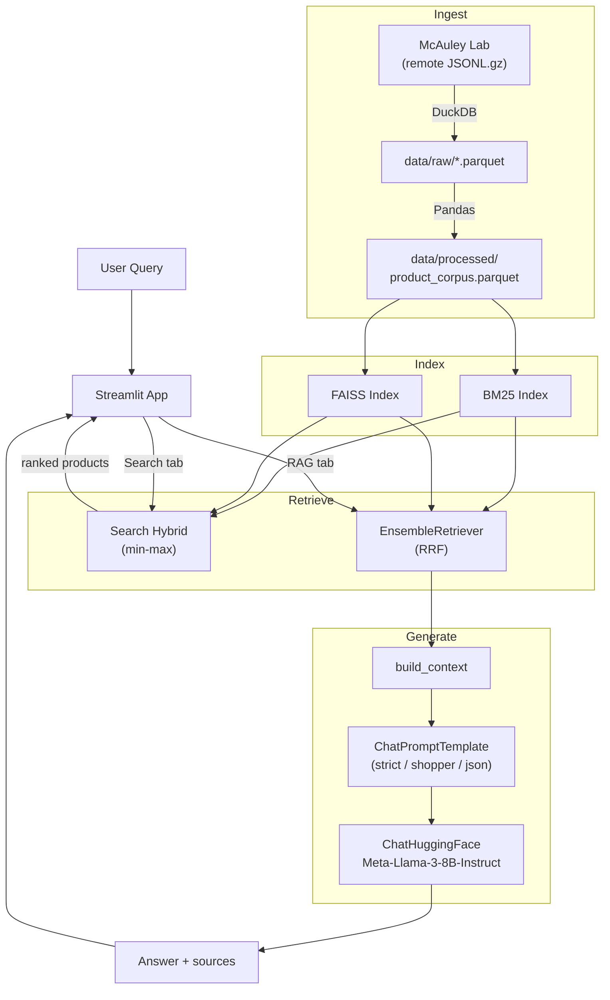

# DSCI 575 - Amazon Beauty Product Search
| | |
| --- | --- |
| CI/CD | [](https://github.com/UBC-MDS/DSCI_575_willchh_jiromig/actions/workflows/ci.yml) |
| Project | [](https://www.python.org/downloads/release/python-3120/) [](https://github.com/UBC-MDS/DSCI_575_project_willchh_jiromig) |
| Meta | [](CODE_OF_CONDUCT.md) [](https://opensource.org/licenses/MIT) |

Hello Ladies and Gentlemen, Are you ready to bring your skin care to the next level?!?!

We have created a retrieval-based product search system for the Amazon All Beauty dataset.
A Streamlit web app for interactive querying is implemented with three retrieval methods: BM25, semantic search, and hybrid.

## Project Specs

### Architecture

The system follows a four-stage pipeline: **ingest → index → retrieve → generate**.

1. **Data Ingestion** — DuckDB reads remote JSONL.gz files from [McAuley Lab](https://amazon-reviews-2023.github.io/) and writes local Parquet files (ZSTD compression). Pandas then builds a unified corpus by concatenating `title`, `description`, `features`, and the most helpful review per product into a single `text` field.
2. **Index Building** — The processed corpus is indexed by two retrieval backends: a BM25 keyword index (pickled) and a FAISS inner-product vector index (binary).
3. **Retrieval** — The Streamlit app exposes two modes: a **Search tab** (Milestone 1) with BM25, Semantic, and Hybrid search, and a **RAG tab** (Milestone 2) that retrieves documents and feeds them to an LLM.
4. **Generation** — The RAG pipeline composes a LangChain retriever, context builder, prompt template, and hosted LLM (`Meta-Llama-3-8B-Instruct` via HuggingFace Inference API) to generate grounded answers.



### Models

| Model | Type | Details |
|-------|------|---------|
| **all-MiniLM-L6-v2** | Sentence-transformer (HuggingFace) | Encodes text into 384-dim normalized vectors for cosine similarity search via FAISS `IndexFlatIP` |
| **BM25Okapi** | Statistical (bag-of-words) | Scores documents by term frequency / inverse document frequency; queries are tokenized with NLTK stopword removal and WordNet lemmatization |
| **Meta-Llama-3-8B-Instruct** | Chat LLM (HuggingFace Inference API) | Default RAG model (8B params); generates grounded answers via `ChatHuggingFace(HuggingFaceEndpoint(...))`; requires `HF_TOKEN` with the accepted Meta Llama 3 license |
| **Qwen3 1.7B** | Chat LLM (Ollama, local) | Comparison model (1.7B params); tested in the final milestone LLM experiment for quality-vs-size analysis; requires Ollama installed locally |

### Tech Stack

| Layer | Technology | Version |
|-------|------------|---------|
| Language | Python | 3.12 |
| Environment | Conda | `environment.yml` → `575-project` |
| Keyword retrieval | rank-bm25 | 0.2.2 |
| Embeddings | sentence-transformers | 5.4.0 |
| Vector search | faiss-cpu | 1.13.2 |
| Text preprocessing | NLTK | 3.9.4 |
| Data ingestion | DuckDB | 1.5.1 |
| Data manipulation | Pandas / NumPy | 2.3.3 / 2.4.1 |
| Web app | Streamlit | 1.56.0 |
| Testing | pytest (+ cov, xdist, randomly, playwright) | 9.0.2 |
| LLM framework | LangChain (LCEL) | 1.2.15 |
| LLM provider | HuggingFace Inference API + Ollama (local) | — |
| LLM model (default) | Meta-Llama-3-8B-Instruct | 8B params |
| LLM model (comparison) | Qwen3 1.7B via Ollama | 1.7B params |
| Web search (optional) | Tavily | 0.7.23 |
| Linting & formatting | Ruff, Black, isort, pre-commit | — |
| CI/CD | GitHub Actions (lint → test → validate-app) | ubuntu-latest |
| Build automation | GNU Make | — |

## Developer Setup

### Dependencies

-   `conda` (version 26.1.0 or higher)
-   [GNU Make](https://www.gnu.org/software/make/) (pre-installed on macOS/Linux; on Windows install via `choco install make` or `winget install GnuWin32.Make`)
-   Python and packages listed in [`requirements.txt`](requirements.txt)

1.  Install [`conda`](https://docs.conda.io/projects/conda/en/latest/user-guide/install/index.html) as a prerequisite.

2.  Open terminal and run the following commands.

3.  Clone the repository:

    ```bash
    git clone https://github.com/UBC-MDS/DSCI_575_project_willchh_jiromig.git
    cd DSCI_575_project_willchh_jiromig
    ```

4.  Create and activate the conda environment:

    ```bash
    conda env create -f environment.yml
    conda activate 575-project
    ```

5.  Run to download data, build the corpus, and build search indices:

    ```bash
    make setup
    ```

    > **Note:** Building the semantic (FAISS) index encodes ~112K products and can take
    > 3-15 minutes depending on hardware. If you prefer to skip this step, download
    > the pre-built indices from the
    > [GitHub Release](https://github.com/UBC-MDS/DSCI_575_project_willchh_jiromig/releases/tag/v0.1.0)
    > instead but make sure to follow the indices/ structure below under Repository Structure:
    >
    > The following commands requires [Github CLI](https://cli.github.com/):
    >
    > ```bash
    > make download-data build-corpus
    > gh release download v0.3.0 --repo UBC-MDS/DSCI_575_project_willchh_jiromig \
    >     --pattern "bm25_index.pkl" --dir indices
    > gh release download v0.3.0 --repo UBC-MDS/DSCI_575_project_willchh_jiromig \
    >     --pattern "index.faiss" --dir indices/faiss_index
    > gh release download v0.3.0 --repo UBC-MDS/DSCI_575_project_willchh_jiromig \
    >     --pattern "corpus.pkl" --dir indices/faiss_index
    > ```

6.  *(Optional)* To run the LLM comparison notebook with the local Qwen3 model, install [Ollama](https://ollama.com/):
    > Download Ollama via the official link here (all platforms): <https://ollama.com/download>

    Or simply run the following commands

    ```bash
    # macOS or Linux
    curl -fsSL https://ollama.com/install.sh | sh

    # Windows (on powershell)
    irm https://ollama.com/install.ps1 | iex
    ```

    Then start an Ollama server and pull the model:

    ```bash
    ollama serve   # keep this terminal open
    ```

    Then on a second terminal, pull the model:

    ```bash
    ollama pull qwen3:1.7b
    ```

7.  Run to locally deploy streamlit app:

    ```bash
    make app
    ```

8.  If you want to run the test suite:

    ```bash
    make test
    ```

9.  For rebuilding the corpus/embeddings:

    ```bash
    make build-corpus
    make build-indices
    ```

10. For linting and formatting:

    ```bash
    make lint # linting
    make format # formatting
    ```

## Repository Structure

```
DSCI_575_project_willchh_jiromig/
├── app/
│   └── app.py                  # Streamlit web app
├── data/
│   ├── raw/                    # Downloaded parquet files (gitignored)
│   ├── processed/              # Cleaned corpus and ground truth queries
│   └── eval_outputs/           # Eval outputs from rag, and llm_comparison notebooks
│       ├── llm_comparison.json
│       └── rag_eval.json
│       └── tool_demo.json
├── indices/                    # Persisted BM25 and FAISS indices (gitignored)
│   ├── bm25_index.pkl          # Follow the following structure for indices
│   └── faiss_index/
│       ├── corpus.pkl
│       └── index.faiss
├── notebooks/
│   ├── milestone1_exploration.ipynb          # Data download and EDA
│   ├── milestone1_retrieval_evaluations.ipynb # Retrieval testing and evaluation
│   ├── milestone2_rag.ipynb                 # RAG pipeline exploration and evaluation
│   └── milestone3_final.ipynb               # LLM comparison and tool demo
├── results/
│   ├── milestone1_discussion.md  # Qualitative evaluation write-up
│   ├── milestone2_discussion.md  # RAG evaluation, model choice, limitations
│   └── final_discussion.md       # LLM experiment, scaling, cloud deployment plan
├── src/
│   ├── bm25.py                 # BM25 retriever class
│   ├── semantic.py             # Semantic (FAISS) retriever class
│   ├── hybrid.py               # Hybrid retriever combining BM25 and semantic
│   ├── utils.py                # Tokenization, corpus building, data download
│   ├── rag_pipeline.py         # RAG pipeline class (LCEL chain)
│   ├── retrievers_lc.py        # LangChain BaseRetriever wrappers
│   ├── prompts.py              # Context builder and prompt templates
│   └── tools.py                # Tavily web search tool
├── tests/                      # pytest test suite
├── Makefile                    # Build automation
├── environment.yml             # Conda environment specification
└── requirements.txt            # Pip dependencies
```

## Data Processing

The dataset is sourced from [Amazon Reviews 2023](https://amazon-reviews-2023.github.io/) (McAuley Lab), using the **All Beauty** category (~112K products, ~701K reviews).

**Fields used for retrieval:**
- `title` — primary product identifier
- `description` — detailed product information
- `features` — bullet-point product attributes
- `reviews_text` — the single most helpful review per product (by `helpful_vote` count)

These fields are concatenated into a single `text` field per product. Price, rating, and images are kept as metadata for display but are not included in the search text.

**Preprocessing pipeline (BM25):**
1. Lowercase
2. Split hyphens and slashes into spaces
3. Remove punctuation
4. Remove English stopwords (NLTK)
5. Lemmatize tokens (NLTK WordNetLemmatizer)

Semantic search uses raw concatenated text (the sentence-transformer model handles its own tokenization).

## Retrieval Methods

**BM25** - Keyword-based retrieval using [rank_bm25](https://github.com/dorianbrown/rank_bm25) (Okapi BM25). Scores documents by term frequency and inverse document frequency. Works best for queries that use exact product vocabulary (e.g., "vitamin C serum", "sunscreen SPF 50").

**Semantic Search** - Embedding-based retrieval using [sentence-transformers](https://huggingface.co/sentence-transformers) (`all-MiniLM-L6-v2`) and [FAISS](https://faiss.ai/) inner-product search. Encodes queries and documents into 384-dimensional vectors and ranks by cosine similarity. Works best for intent-based queries where the user paraphrases or describes a need (e.g., "something to protect from sun damage").

**Hybrid Search** - Combines BM25 and semantic scores via weighted linear combination. Both score sets are min-max normalized to [0, 1], then combined: `score = bm25_weight * bm25_score + (1 - bm25_weight) * semantic_score`. The weight is configurable in the app.

## RAG Pipeline (Milestone 2)

The RAG tab in the Streamlit app composes four components into a Retrieval-Augmented Generation pipeline:

1. **Retriever** — BM25, Semantic, or Hybrid (LangChain `EnsembleRetriever` with Reciprocal Rank Fusion). Thin `BaseRetriever` wrappers delegate to the existing Milestone 1 retriever classes, preserving the original tokenization and indices.
2. **Context builder** — `src/prompts.py::build_context` formats the top-k retrieved documents into a numbered block with ASIN, title, rating, price, and a truncated review.
3. **Prompt template** — One of three `ChatPromptTemplate` variants:
   - `strict_citation` — answers only from context, cites ASINs for every claim
   - `helpful_shopper` — friendly recommendation style, mentions price and rating
   - `structured_json` — returns a JSON object with `recommendation`, `reasoning`, `asins`
4. **LLM** — `ChatHuggingFace(HuggingFaceEndpoint(repo_id="meta-llama/Meta-Llama-3-8B-Instruct"))` via the HuggingFace Inference API. No local GPU required.

### Required environment variables

| Variable | Required | Purpose |
|---|---|---|
| `HF_TOKEN` | Yes (for RAG tab) | HuggingFace token with read access. Must have [accepted the Meta Llama 3 license](https://huggingface.co/meta-llama/Meta-Llama-3-8B-Instruct). |
| `TAVILY_API_KEY` | No | Enables the optional web-search tool toggle in the RAG tab. Without it the toggle is disabled. |

Add these to your `.env` file (see `.env.example`).

### RAG usage

```bash
make setup                        # one-time data + index build
echo "HF_TOKEN=hf_xxx" >> .env    # add your HuggingFace token
make app                          # opens the Streamlit app; click the "RAG" tab
```

## Contributors

- William Chong
- Jiro Amato

## License

- Copyright © 2026 William Chong, Jiro Amato

- Free software distributed under the [MIT License](./LICENSE.md).
